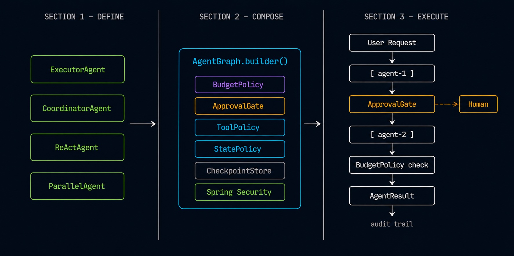

# AgentFlow4J

**Most agent frameworks help you build agents. AgentFlow4J helps you run them in production.** Security, authorization, governance, resilience, and FinOps — built into every workflow, JVM-native, Spring-powered.

<p align="center">


</p>

No orchestration boilerplate. No hidden execution. Just define your agents and run.

[](https://github.com/datallmhub/agentflow4j/actions)
[](https://adoptium.net/)
[](https://docs.spring.io/spring-ai/reference/)
[](LICENSE)

---
        
## 🚀 Try it in 30 seconds (no API key)

```bash
git clone https://github.com/datallmhub/agentflow4j.git
cd agentflow4j
mvn install -DskipTests -q
mvn -pl agentflow4j-samples exec:java
```

Runs `SupportTriageDemo` — a customer-support ticket flowing through a graph: triage → specialist → policy gate → reply. Falls back to deterministic stubs offline, or calls Mistral when `MISTRAL_API_KEY` is set.

---

## 🎬 Example in action

One real workflow built with AgentFlow4J — a customer-support triage app. This is **one sample use case**, not the framework itself; you compose your own agents and graphs the same way.

<p align="center">

</p>

▶ Live demo: <https://huggingface.co/spaces/datallmhub/multi-agent-customer-ops>

---

## ⚡ In 60 seconds

```java
ExecutorAgent researcher = ExecutorAgent.builder()
        .chatClient(chatClient)
        .systemPrompt("Find key facts.")
        .build();

ExecutorAgent writer = ExecutorAgent.builder()
        .chatClient(chatClient)
        .systemPrompt("Write a clear report.")
        .build();

CoordinatorAgent coordinator = CoordinatorAgent.builder()
        .executors(Map.of("research", researcher, "writing", writer))
        .routingStrategy(RoutingStrategy.llmDriven(chatClient))
        .build();

AgentResult result = coordinator.execute(
        AgentContext.of("Compare Claude 4 and GPT-5"));
```

A multi-step, stateful workflow with routing, coordination, and resilience — without writing orchestration code.

⭐ **If this saves you time, consider [starring the repo](https://github.com/datallmhub/agentflow4j).**

---

## Why AgentFlow4J?

No other agent framework combines these five dimensions in a single JVM-native runtime:

| Dimension | What you get |
|---|---|
| **Security & AuthZ** | Spring Security integration — your existing roles and permissions govern which agents can act |
| **Governance** | `ApprovalGate`, `ToolPolicy`, `StatePolicy` — agents are not implicitly trusted |
| **FinOps** | `BudgetPolicy` at RUN / NODE / CALL granularity + `BudgetAwareRouter` for cost-aware routing |
| **Resilience** | `RetryPolicy` + `FailureClassifier` (TRANSIENT / PERMANENT / OVER_BUDGET) — typed, composable |
| **Spring runtime** | Actuator, Micrometer, JPA, Flyway, `application.yml` — no new infrastructure to deploy or audit |

LangGraph, ADK, CrewAI and AutoGen bring their own runtimes. AgentFlow4J runs on the Spring stack your team already owns, already secures, and already operates.

**Use it if** your workflow spans multiple agents, failures matter, costs need capping, or a human must approve before an action executes.
**Skip it if** you make a single `ChatClient` call.

---

## 🛡 Governed by default

Agents are **not implicitly trusted**. Gate what they can call, what they can change, what they can spend, and when a human must step in — without writing governance glue:

```java
// 1. restrict which tools an agent may call (gated on the executor)
ExecutorAgent paymentAgent = ExecutorAgent.builder()
    .chatClient(chatClient)
    .tools(webSearch, shellTool)
    .toolPolicy(ToolPolicy.allowList("web.search").and(ToolPolicy.denyList("shell.execute")))
    .build();

// state, cost and approval are gated on the graph
AgentGraph.builder()
    .addNode("assistant", assistant)
    .addNode("payment.transfer", paymentAgent)
    // 2. protect sensitive state keys from being written
    .statePolicy(StatePolicy.denyWriteKeys("payment.confirmed"))
    // 3. cap spend per run / node / call
    .budgetPolicy(BudgetPolicy.hierarchical(BudgetLimits.run(2.00), estimator, meter))
    // 4. pause for a human before high-stakes nodes
    .approvalGate(ApprovalGate.requireFor("payment.transfer"))
    .checkpointStore(store)
    .build();
```

Each gate is opt-in with a zero-overhead default. See [Tool policy](docs/tool-policy.md), [State policy](docs/state-policy.md), [Approval gate](docs/approval-gate.md), and [Budget policy](docs/resilience.md#6-budget-policy-cost-gate).

---

## 🧩 Two levels of control

- **Squad API** — dynamic routing, minimal setup. A `CoordinatorAgent` dispatches to `ExecutorAgent`s.
- **Graph API** — explicit flows, loops, conditions, full control.

Both are covered in the [docs](#-documentation).

---

## 🛠 Installation

**Requirements:** Java 17+, Spring Boot 3.x, Spring AI 1.0+.
Distributed via [JitPack](https://jitpack.io).

### Maven

```xml
<repositories>
    <repository>
        <id>jitpack.io</id>
        <url>https://jitpack.io</url>
    </repository>
</repositories>

<dependency>
    <groupId>com.github.datallmhub.agentflow4j</groupId>
    <artifactId>agentflow4j-starter</artifactId>
    <version>v0.7.0</version>
</dependency>
```

### Gradle

```groovy
repositories { maven { url 'https://jitpack.io' } }
dependencies { implementation 'com.github.datallmhub.agentflow4j:agentflow4j-starter:v0.7.0' }
```

### Modules

| Module | Purpose |
|---|---|
| `agentflow4j-starter` | Spring Boot auto-config, properties, Micrometer listener |
| `agentflow4j-core` | Minimal API (`Agent`, `AgentContext`, `StateKey`, `AgentResult`) |
| `agentflow4j-graph` | `AgentGraph`, `RetryPolicy`, `CircuitBreakerPolicy`, `BudgetPolicy`, checkpoint contract |
| `agentflow4j-squad` | `CoordinatorAgent`, `ExecutorAgent`, `ReActAgent`, `ParallelAgent` |
| `agentflow4j-checkpoint` | `JdbcCheckpointStore`, `RedisCheckpointStore`, Jackson codec |
| `agentflow4j-resilience4j` | `CircuitBreakerPolicy` adapter backed by Resilience4j |
| `agentflow4j-playground` | Drop-in web UI to chat with your `Agent` beans |
| `agentflow4j-cli-agents` | `CliAgentNode` — Claude Code / Codex / Gemini CLI as graph nodes |
| `agentflow4j-test` | `MockAgent`, `TestGraph` for LLM-free unit tests |

---

## 📚 Documentation

- [Two API levels (Squad + Graph)](docs/two-api-levels.md) — when to use which, with code
- [LLM providers](docs/llm-providers.md) — swap between Mistral, OpenAI, Claude, Gemini, Ollama with two lines of config
- [Typed state](docs/state.md) — `StateKey<T>` instead of `Map<String, Object>`
- [Tool policy](docs/tool-policy.md) — allow/deny tool calls per agent, with argument-aware rules
- [State policy](docs/state-policy.md) — allow/deny writes to specific `StateKey<T>`, with argument-aware rules
- [Approval gate](docs/approval-gate.md) — human-in-the-loop pause/resume on sensitive nodes
  - [Recipe: approval via Slack](docs/recipes/approval-via-slack.md) — async, non-blocking, ~30 lines
- [Resilience & error handling](docs/resilience.md) — retries, circuit breaker, budget policy
  - [Recipe: durable runs](docs/recipes/durable-runs.md) — crash mid-workflow, resume from the last checkpoint
- [Observability](docs/observability.md) — Micrometer metrics, tags, listeners
- [Run log](docs/run-log.md) — structured, replayable execution timeline per run
- [Streaming](docs/streaming.md) — `Flux<AgentEvent>` tokens, transitions, tool calls
- [Testing without an LLM](docs/testing.md) — `MockAgent` + `TestGraph`
- [Samples](docs/samples.md) — runnable examples shipped with the repo

**Cookbook:** [AgentFlow4J Cookbook](https://github.com/datallmhub/agentflow4j-cookbook) — standalone, copy-paste recipes (RAG agent, support-ticket triage, web research, Slack bot, batch document processing), each a self-contained Maven module that runs locally against Ollama.

**Tutorial:** [Stop your AI agent from burning $1000 overnight](docs/tutorials/stop-your-agent-burning-money.md) — governed execution end to end.

---

## 📈 Roadmap

| Version | Status | Focus |
|---------|--------|-------|
| **0.5** | shipped | Subgraphs, parallel fan-out, cancellation, typed output, retry/circuit-breaker/budget policies, JDBC/Redis checkpoint store, web playground |
| **0.6** | shipped | Governed execution: `ToolPolicy`, `StatePolicy`, `ApprovalGate` (allow/deny tools, guard state writes, human-in-the-loop pause/resume) |
| **1.0** | planned | API stabilization, documentation, community feedback |
| **1.1** | planned | Crew roles (CrewAI-inspired), auto-config for checkpoint backends |
| **2.0** | exploring | OpenTelemetry tracing, MCP integration, Agent-as-Tool |

---

## 📝 Note on scope

It is not an official Spring project.

---

## 🤝 Contributing & License

Contributions welcome — see [CONTRIBUTING.md](CONTRIBUTING.md).
Released under the [Apache 2.0 License](LICENSE).
