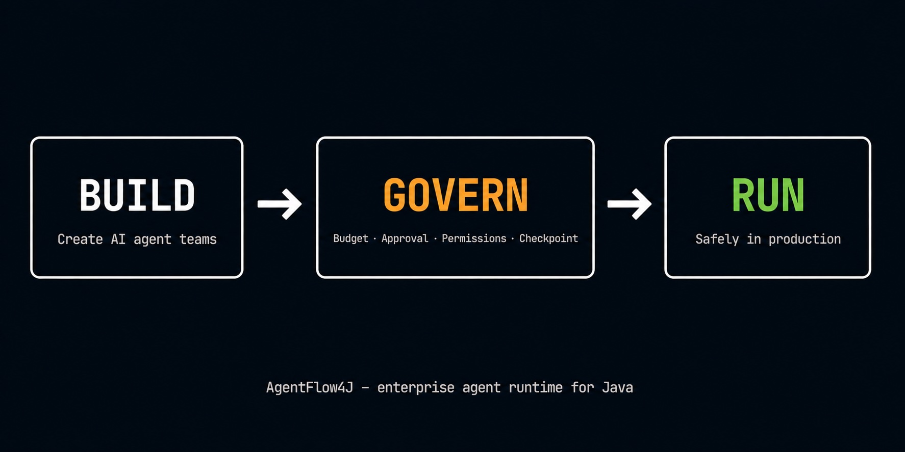

# AgentFlow4J

**Build AI agents you can trust in production.**

AgentFlow4J is a framework and runtime for governed, stateful multi-agent systems on the JVM.

Human approvals · Checkpoints · Budget controls · Tool policies · Durable execution

---

## Why AgentFlow4J?

- Build multi-agent workflows with explicit orchestration
- Persist execution across failures and restarts
- Add human approval where it matters
- Control tool access and AI spend
- Run natively on the JVM and Spring ecosystem

---

<p align="center">

</p>

[](https://github.com/datallmhub/agentflow4j/actions)
[](https://adoptium.net/)
[](https://docs.spring.io/spring-ai/reference/)
[](LICENSE)

---

## ⚡ In 60 seconds

```java
// Define your agents
ExecutorAgent analyst = ExecutorAgent.builder()
    .chatClient(chatClient)
    .systemPrompt("Analyse this request.")
    .toolPolicy(ToolPolicy.allowList("search", "fetch"))
    .build();

// Compose a governed graph
AgentGraph graph = AgentGraph.builder()
    .addNode("analyse", analyst)
    .budgetPolicy(BudgetPolicy.perRun(0.50, estimator, meter))
    .approvalGate(ApprovalGate.requireFor("analyse"))
    .checkpointStore(new JdbcCheckpointStore(dataSource))
    .build();

AgentResult result = graph.run(AgentContext.of("Process this refund request"));
```

`ToolPolicy` restricts which tools the agent can call. `BudgetPolicy` caps spend at $0.50 per run. `ApprovalGate` pauses execution until a human approves. `CheckpointStore` persists graph state: the run resumes from the last completed node after a restart.

⭐ **If this saves you time, consider [starring the repo](https://github.com/datallmhub/agentflow4j).**

---

## 🚀 Try the demo in 5 minutes

```bash
git clone https://github.com/datallmhub/agentflow4j.git
cd agentflow4j
mvn install -DskipTests -q
mvn -pl agentflow4j-samples exec:java
```

Runs `SupportTriageDemo` by default: a governed multi-agent workflow with `ToolPolicy` and `ApprovalGate` active. No API key required; falls back to deterministic stubs, or calls Mistral when `MISTRAL_API_KEY` is set.

See [all samples](docs/samples.md) to explore other demos.

▶ [See it in action](https://huggingface.co/spaces/datallmhub/multi-agent-customer-ops): live demo of a sample implementation, a governed multi-agent customer-support workflow.

---

## Core capabilities

| Capability | What it does | AgentFlow4J |
|---|---|---|
| **Multi-agent orchestration** | Build agent teams with routing and fan-out | `AgentGraph`, `CoordinatorAgent`, `ParallelAgent` |
| **Governance** | Control what agents can call, change, or spend | `ToolPolicy`, `StatePolicy`, `BudgetPolicy`, `ApprovalGate` |
| **Durable execution** | Survive restarts, resume from last checkpoint | `JdbcCheckpointStore`, `RedisCheckpointStore` |
| **Human-in-the-loop** | Pause before critical actions, resume on approval | `ApprovalGate` |
| **Resilience** | Classify failures, retry smart, route to fallback | `RetryPolicy`, `FailureClassifier`, `BudgetAwareRouter` |
| **Observability** | Metrics, run logs, streaming events | Micrometer, `RunLog`, `Flux<AgentEvent>` |

Two API levels: **Squad API** for dynamic routing with minimal setup, **Graph API** for explicit flows, loops and full control. See [Two API levels](docs/two-api-levels.md).

---

## 🛠 Installation

See [Getting started](docs/getting-started.md) for Maven/Gradle setup and module reference.

---

## 📚 Documentation

- [Two API levels (Squad + Graph)](docs/two-api-levels.md): when to use which, with code
- [LLM providers](docs/llm-providers.md): swap between Mistral, OpenAI, Claude, Gemini, Ollama with two lines of config
- [Typed state](docs/state.md): `StateKey<T>` instead of `Map<String, Object>`
- [Tool policy](docs/tool-policy.md): allow/deny tool calls per agent, with argument-aware rules
- [State policy](docs/state-policy.md): allow/deny writes to specific `StateKey<T>`, with argument-aware rules
- [Approval gate](docs/approval-gate.md): human-in-the-loop pause/resume on sensitive nodes
  - [Recipe: approval via Slack](docs/recipes/approval-via-slack.md): async, non-blocking, ~30 lines
- [Resilience & error handling](docs/resilience.md): retries, circuit breaker, budget policy
  - [Recipe: durable runs](docs/recipes/durable-runs.md): crash mid-workflow, resume from the last checkpoint
- [Observability](docs/observability.md): Micrometer metrics, tags, listeners
- [Run log](docs/run-log.md): structured, replayable execution timeline per run
- [Streaming](docs/streaming.md): `Flux<AgentEvent>` tokens, transitions, tool calls
- [Testing without an LLM](docs/testing.md): `MockAgent` + `TestGraph`
- [Samples](docs/samples.md): runnable examples shipped with the repo

**Cookbook:** [AgentFlow4J Cookbook](https://github.com/datallmhub/agentflow4j-cookbook): standalone, copy-paste recipes (RAG agent, support-ticket triage, web research, Slack bot, batch document processing), each a self-contained Maven module that runs locally against Ollama.

**Tutorial:** [Stop your AI agent from burning $1000 overnight](docs/tutorials/stop-your-agent-burning-money.md): governed execution end to end.

---

## 📈 Roadmap

| Version | Status | Focus |
|---------|--------|-------|
| **0.5** | shipped | Subgraphs, parallel fan-out, cancellation, typed output, retry/circuit-breaker/budget policies, JDBC/Redis checkpoint store, web playground |
| **0.6** | shipped | Governed execution: `ToolPolicy`, `StatePolicy`, `ApprovalGate`: allow/deny tools, guard state writes, human-in-the-loop pause/resume |
| **0.7** | shipped | Adaptive execution: reason-aware retry (`FailureClassifier`), cost-aware routing (`BudgetAwareRouter`) |
| **1.0** | in progress | API stabilization pass · lifecycle hooks (`onCheckpoint`, `onToolCall`, `onFailure`) · MCP compatibility · OpenHands integration adapter · Parallel-DAG execution |
| **2.0** | exploring | Temporal-like interruption, compensation/saga, OpenTelemetry tracing |

---

## 🤝 Contributing & License

Contributions welcome: see [CONTRIBUTING.md](CONTRIBUTING.md).
Released under the [Apache 2.0 License](LICENSE). Not an official Spring project.
